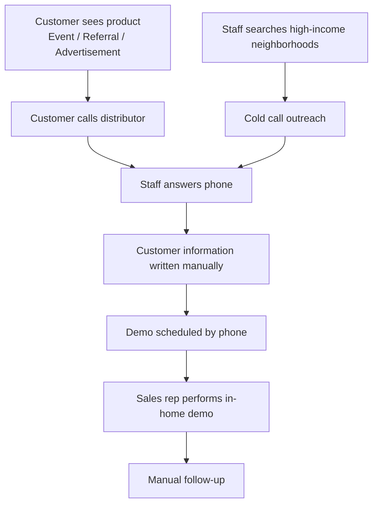
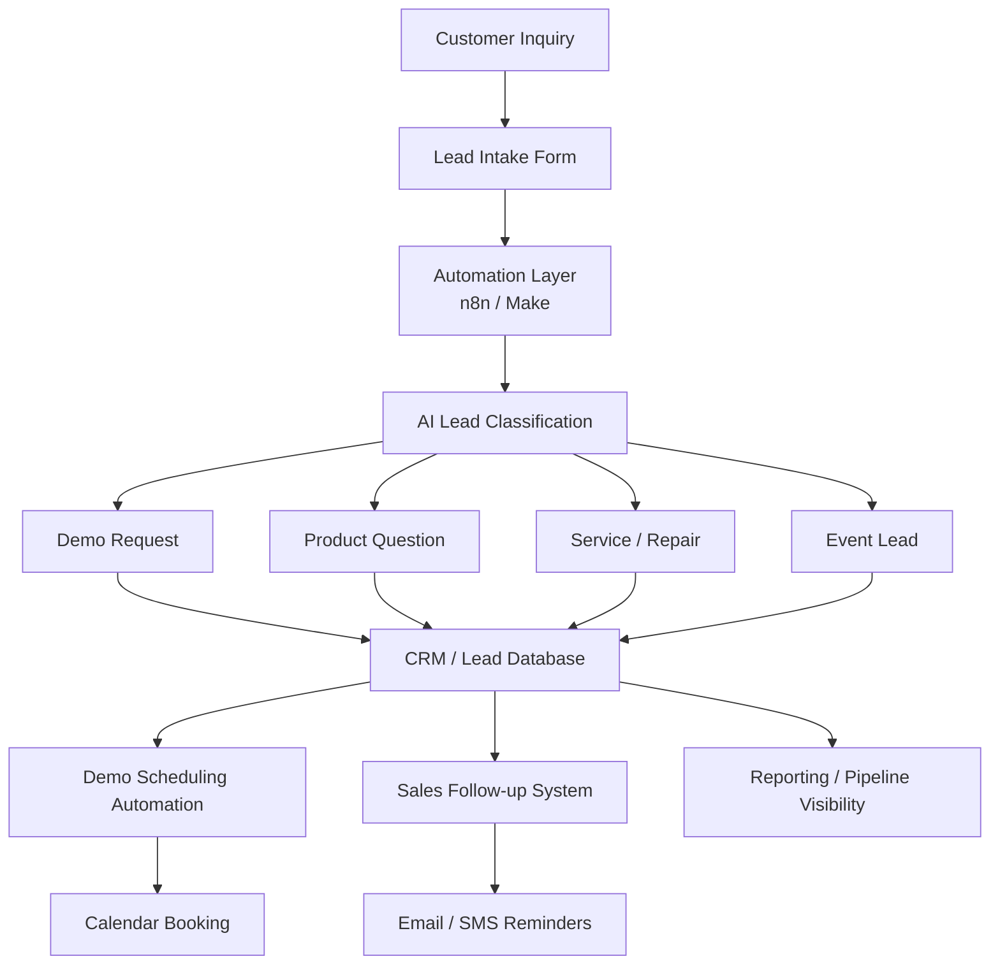

# AI-Assisted Sales Workflow Automation (Case Study)

This case study analyzes the manual sales intake and demonstration scheduling workflow used by a regional home appliance distributor and proposes a modern automation architecture.

The current process relies primarily on phone calls, event leads, and manual scheduling. The proposed system introduces structured intake, workflow orchestration, and AI-assisted classification to reduce response time, prevent missed leads, and improve sales visibility.

The design focuses on lightweight automation suitable for small businesses using workflow tools such as n8n, AI classification models, and simple CRM integrations.

---

## 1. Current Workflow (Observed)

Lead generation currently occurs through two primary channels:

• **Inbound leads** from events, referrals, and product exposure  
• **Outbound prospecting** where staff identify high-income neighborhoods and perform cold outreach calls

Both lead sources ultimately converge into the same manual intake and scheduling process.

### Current Workflow Diagram



Typical flow:

```text
Customer sees product (event, referral, advertisement)
        ↓
Customer calls distributor
        ↓
Staff manually records contact information
        ↓
Staff schedules in-home demo by phone
        ↓
Sales representative performs demo
        ↓
Follow-up handled manually
```

Operational characteristics:

- phone-driven intake
- no structured lead tracking
- scheduling handled manually
- limited visibility into sales pipeline

---

## 2. Key Operational Risks

Manual workflows introduce several inefficiencies.

### Lead Loss Risk
Incoming calls or event leads may not be logged consistently.

### Slow Response Time
Lead response depends on staff availability.

### Scheduling Friction
Manual coordination slows demo booking.

### No Lead Intelligence
There is no structured lead data to support prioritization or follow-up.

### Limited Reporting
Owners lack visibility into the sales pipeline.

---

## 3. Proposed Future-State Architecture

The proposed system introduces a lightweight automation layer.

### Visual Architecture Diagram



### Workflow Overview

```text
Customer Inquiry
     ↓
Lead Intake Form
     ↓
Automation Layer (n8n)
     ↓
AI Lead Classification
     ↓
CRM / Lead Database
     ↓
Demo Scheduling System
     ↓
Automated Follow-up
```

### System Components

#### Lead Intake
Web form or QR code for capturing event leads.

#### Automation Layer
Workflow engine (n8n or Make) routes and processes leads.

#### AI Classification
Model categorizes leads into:

- new sales inquiry
- service request
- product question
- event lead

#### CRM Storage
Lead stored in simple CRM or Airtable.

#### Scheduling Automation
Calendar integration allows automated demo booking.

#### Follow-up System
Email or SMS reminders for demos and post-demo outreach.

---

## 4. AI Classification Logic

AI assists with lead triage.

Example prompt:

```text
Classify this customer message into one category:

1. Demo Request
2. Product Question
3. Service / Repair
4. Event Lead
```

Benefits:

- reduces manual sorting
- ensures leads reach correct pipeline
- enables analytics over time

---

## 5. Expected Business Impact

Operational improvements expected from this automation system:

- Lead response time: Hours → Minutes
- Scheduling coordination: Manual → Automated booking
- Lead visibility: None → Structured pipeline
- Sales follow-up: Manual → Automated sequences
- Owner reporting: Minimal → Real-time dashboards

For small distributors, faster lead response and structured follow-up can significantly improve demo conversion rates, which directly impacts revenue generation.

---

## 6. Technologies Considered

Possible implementation stack:

• Workflow orchestration: n8n or Make  
• AI classification: OpenAI / LLM API  
• CRM / lead storage: Airtable, HubSpot, or Google Sheets  
• Scheduling: Google Calendar integration  
• Notifications: Email or SMS automation

---

## 7. Implementation Phases

### Phase 1: Lead Capture System
- event QR code
- simple intake form

### Phase 2: Workflow Automation
- intake to CRM
- AI classification

### Phase 3: Scheduling Automation
- calendar booking
- demo reminders

### Phase 4: Follow-up Automation
- demo follow-ups
- service reminders

---

## 8. Why This Matters

Many small businesses operate on decades-old workflows that rely heavily on phone coordination and manual tracking.

Modern automation tools allow these businesses to dramatically improve operational efficiency without requiring complex infrastructure.

This case study demonstrates how lightweight AI-assisted workflow automation can modernize legacy sales processes while remaining accessible to small regional distributors.

## 9. Operational Constraints

The proposed system must remain lightweight due to the nature of the business:

• Small team with limited technical infrastructure  
• Sales performed through in-home demonstrations  
• Distributor relationship with manufacturer systems  
• Minimal existing digital tooling

For this reason, the proposed automation focuses on low-friction tools such as workflow automation platforms, lightweight CRM solutions, and AI-assisted routing rather than complex enterprise systems.
